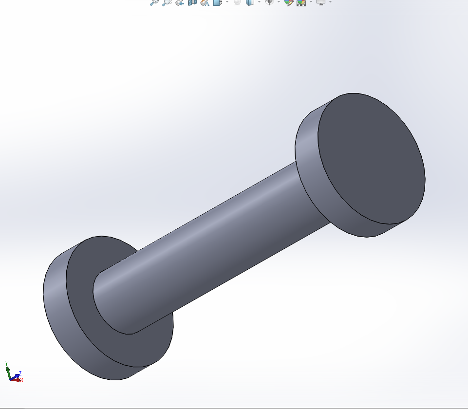

# Intermediate_CAD
## Design Tables
Made a table. Reflection: I learned to choose a circle on circular pattern instead of a face.

 

## Pin 
Made a pin to be put in Advanced and Mechanical Mates Assembly

## Advanced and Mechanical Mates
Created box-like part to be put in Advanced and Mechanical Mates Assembly
## Advanced and Mechanical Mates Assembly
Combined Pin and Advanced and Mechanical Mates parts to make a sliding box-like assembly. 
